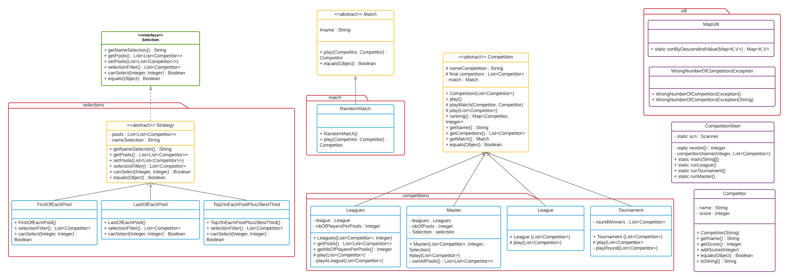

# UE Conception Orientée Objet

## Projet : Compétitions Sportives

##### Binôme : FRET Gaëlle & SKOCZYLAS Nestor
<br/>

***
<br/>

### Rapide introduction sur le sujet du projet

Le principe de ce projet réside en la création d'une application permettant la mise en compétition de joueurs, lors de tournois, de ligues sportives ou de masters.<br/><br/>

### Rubrique ‘HowTo’ (avec les commandes précises) :<br/><br/>

* <u>La récupération du dépôt se fait grâce à la commmande : </u>

    ```bash
    git clone git@gitlab-etu.fil.univ-lille1.fr:skoczylas/projet_coo.git
    ```

* <u>Commande de génération de la documentation (et information sur la localisation de cette documentation) :</u>

   ```bash
    make docs
    ```

    → La documentation se trouve dans le répertoire *target/site/apidocs* puis ouvrez le fichier *index.html*
    <br/>

    <span style = "color: red"> /!\  Attention, si vous voulez que cela fonctionne veillez à bien configurer votre variable d'environnement "JAVA_HOME" et à avoir d'installé sur votre pc le "Java Development Kit" (JDK).</span>

    <br/>

* <u>Commande de génération de l’archive du projet :</u>

    ```bash
    make jar
    ```

* <u>Commande d’exécution de l’archive générée :</u>
    Dans le dossier principal :

    ```bash
    java -cp target/competition-1.0-SNAPSHOT.jar competition.CompetitionMain 
    ```

    <br/>

#### Présentation d’éléments de code saillants :<br/><br/>

* <u>Les éléments de conception jugés importants et intéressants de ce projet sont :</u>

  * La création de mocks dans les classes de tests de `Match` et `Competition`. Par conséquent, les matchs simulés de manière aléatoire peuvent être testés.

  * La mise en abstraction des classes `Match` et `Competition` permettent, si souhaité, d'ajouter de nouvelles sous-classes. De même pour l'interface `Selection` et la classe abstraite `Strategy` qui l'implémente.<br/><br/>

* <u>Architecture du code :</u>
    <br/>

    Dans le package competition :
    <br/>

  * La classe `Competitor` crée les compétiteurs, possédant pour chacun un nom (**+getName() : String**) et un nombre de points (**+getScore() : int**). La méthode **+addScore(int)** change le score du compétiteur.
    <br/>

  * La classe abstraite `Match`, précédemment énoncée, possède une méthode abstraite **#play(Competitor, Competitor)**. En outre, cette conception met en valeur la possibilité de création de plusieurs types de matchs. La méthode **play()** pourra être ainsi surchargée dans les différents types de matchs.
    <br/>

  * La classe abstraite `Competition` sert à organiser un ensemble de match suivant certaines règles. Ces règles seront ici nommées à titre de sous-classes. Ci-dessous, les méthodes principales de cette classe :
    <br/>

    > **+play()** : appelle *playMatch(Competitor,Competitor)* qui organise les matchs de la compétition entre les compétiteurs puis appelle *ranking()* qui retourne les joueurs et leur nombre de points par ordre décroissant.<br/>
    > ***#play(List<Competitor>)*** : méthode abstraite qui sera surchargée dans les sous-classes. Elle donne les règles de chaque type de compétition ;<br>
    > **#playMatch(Competitor, Competitor)** : joue les matchs entre deux compétiteurs, en fonction du type de match choisi.<br/>
    > **+ranking() : Map<Competitor,Integer>** : affiche le nom des compétiteurs et leur nombre de points, rangé par ordre décroissant.<br/>
    > **+getName() : String** : renvoi le nom de la compétition.<br/>
    > **+getCompetitors() : List<Competitor>** : retourne la liste de tout les compétiteurs.<br/>
    > **+getMatch() : Match** : renvoi le match.
    <br/>

  * L'interface `Selection`. Elle contient les signatures des méthodes :
    > **+getNameSelection() : String** : donne le nom de la selection.<br/>
    > **+getPools() : List<List<Competitor>>**  : renvoi la liste des compétiteurs répartis dans des poules.<br/>
    > **+setPools(List<List<Competitor>>)**  : modifie la liste des compétiteurs répartis dans des poules.<br/>
    > **+selectionFilter() : LisList<List<Competitor>>t<Competitor>** : permet de selectionner les gagnants des pools lors d'une Leagues.
    <br/>

  * `CompetitionMain`, permet de lancer une partie au choix avec un nombre correct de joueurs dont les noms devront être fournis par l'utilisateur, selon les méthodes suivantes :
    > **-nextInt() : Integer** : méthode `static` qui renvoi un nombre positif entré par l'utilisateur.<br/>
    > **-competitorsName(int, List<Competitor>)** : méthode `static` qui demande un nom pour chaque compétiteur.<br/>
    > **+main(String[])** : méthode `static` qui permet de choisir une ligue, un tournoi ou un master via l'entrée de la console.<br/>
    > **+runLeague()** : méthode `static` qui joue la ligue.<br/>
    > **+runTournament()** : méthode `static` qui joue le tournoi.<br/>
    > **+runMaster()** : méthode `static` qui joue le master.

    <br/>

    Dans le package match :
  * La sous-classe `RandomMatch`, héritant de la classe `Match`, offre la possibilité de jouer, grâce à la méthode **+play(Competitor, Competitor) : Competitor**, un match ayant une issue aléatoire.  
    <br/>

    Dans le package competitions :

  * `League`, héritant de la classe `Competition`, fait jouer des matchs en aller/retour. Le gagnant est celui qui remporte le plus de victoire.
    La surcharge de la méthode **#play(List<Competitor>)** joue la ligue et applique les règles énoncées.
    <br/>

  * `Tournament`, héritant de la classe `Competition`. À l'issue de chaque match, le compétiteur vaincu est éliminé jusqu'à ce qu'il ne reste qu'un joueur.<br/>
    La méthode **#play(List<Competitor>)** surchargée met en pratique les règles stipulées. De plus, la méthode **-playRound(List<Competitor>) : List<Competitor>** joue un round de match entre les compétiteurs et élimine les perdants.
    <br/>

  * `Leagues` héritant de la lasse `Competition`. Il s'agit d'un ensemble de League. Pour jouer (**#play(List<Competitor>)**), l'utilisateur choisi le nombre de pools jouées et quels competiteurs seront les gagnants. De plus, la méthode ,**-playALeague(List<Competitor>)**, permet à une ligue d'être joué par une poules de compétiteurs.<br/>
    Cette classe possède également une méthode pour obtenir la liste de tous les compétiteurs répartis dans chaques poules : **+getPools() : List<List<Competitor>>**. Tandis que **+getNbOfPlayersPerPool() : int** renvoi le nombre de compétiteurs par poules.
    <br/>

  * `Master`, héritant de la classe `Competition`. Elle fait jouer (**#play(List<Competitor>, Filter)**) une compétition en deux partie. La première sera une Leagues, la deuxième un Tournament. Et la méthode, **-sortAllPools() : List<List<Competitor>>**, permet de classer dans chaque poule les compétiteurs dans un ordre décroissant.
    <br/>

    Dans le package selections :
  * `Selection` est une interface permettant la selection des gagnants lors des pools de Leagues.
  * `Strategy` est une classe abstraite implémentant `Selection` et met en place les différentes selections.
  * `FirstOfEachPool`, `LastOfEachPool` et `Top2InEachPoolPlus2BestTHird` sont des sous-classes héritant de la classe abstraite `Strategy`. `FirstOfEachPool` sélectionne le compétiteur avec les plus de points dans sa poule, tandis que `LastOfEachPool` prend celui avec le moins de points. Enfin, `Top2InEachPoolPlus2BestTHird` sélectionne les premiers et les seconds meilleurs compétiteurs de chaque poule.
    Ces classes possèdent toutes les 3 les mêmes méthodes :
    > **+getNameSelection() : String** : renvoi le nom de la selection.<br/>
    > **+selectionFilter() : List<Competitor>** : sélectionne le compétiteur ayant le plus de points dans sa poule.<br/>
    > **+setPools(List<List<Competitor>>)** : modifie la liste des compétiteurs divisé en poule.<br/>
    > **+canSelect(int, int) : boolean** : permet de savoir si cette méthode de `Selection` peut être utilisée en fonction du nombre de poules, elle retourne un boolean.

    <br/>

    Dans le package util :
  * `MapUtil`, est composée de la méthode **+ sortByDescendindValue** qui retourne la liste des compétiteurs avec leur nombre de point classé par ordre décroissant.
  * `WrongNumberOfCompetitorsException`, permet de gérer les règles sur le nombre de joueurs à avoir dans un Tournament ou une League.

    <br/>

* <u>Présentation des principes de conception mis en œuvre :</u>

  * Le patron de conception, dit *design pattern*, mis en oeuvre dans ce projet est <strong>Strategy</strong> est util dès lors qu'un objet peut effectuer plusieurs traitements différents, dépendant d'une variable ou d'un état. Ici la classe abstraite `Strategy` implemente l'interface `Selection` et les sous-classes `FirstOfEachPool`, `LastOfEachPool` et `Top2InEachPoolPlus2BestTHird` héritent de celle-ci. C'est pour éviter la répétition de code que la classe abstraite `Strategy` a été créée. L'utilisation de ce *design pattern* est un choix pratique et nécessaire pour une meilleur comprehension du code.

  <br/>

* <u>Tout point que vous souhaitez mettre en avant pour valoriser votre projet :</u>
<br/>
  * En utilisant des classes abstraites pour `Match`, `Competition` et `Strategy`, le principe ouvert-fermé est respecté. Par conséquent, il sera possible d'ajouter de nouvelles sous-classes.
    <br/>
  * Le main permet à l'utilisateur de choisir son nombre de joueurs ainsi que leur nom et le type de compétition auquel il souhaite jouer.
    <br/>
  * Des tests abstraits ont été codés ainsi que des mocks. Cela permet d'éviter la redondance de code et de pouvoir tester les matchs aléatoires.

***

## UML Livrable 2

<br/>


***

<u>Les liens utiles :</u>

> Lien Sujet : <https://www.fil.univ-lille1.fr/~quinton/coo/projet/competitions.pdf><br/>
> Lien UML : <https://lucid.app/lucidchart/invitations/accept/inv_bbed0a8f-d1a9-4389-a9a5-261919a42226?viewport_loc=-900%2C-314%2C3679%2C1771%2C0_0>
