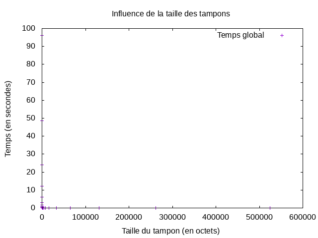
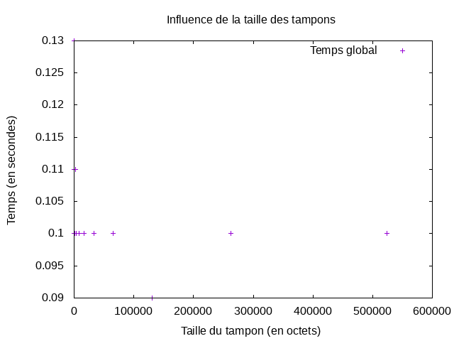

# Performances des entrées/sorties

## Binome : SKOCZYLAS Nestor & FRET Gaëlle

### Questions traitées

Nous avons traité toutes les questions.

Les difficultés que nous avons rencontré sont :

- l'implémentation de la commande cat
- la création du graphique à l'aide de GnuPlot

<br/>

### Implémentation mcat et lancement

Pour compiler le fichier `mcat.c`, utilisez la commande : `make`<br/>
Pour tester après compilation, faites :

```$ bash
./mcat 1 Code-du-travail.txt
```

1. `./mcat` est le fichier après la compilation;<br/>
2. `1` un nombre signifiant la taille du tampon choisi par l'utilisateur;<br/>
3. `Code-du-travail.txt` est fichier texte lambda.<br/>

/!\ Attention, à la fin de l'utilisation du fichier, utilisez la commande :

``` $ bash
make clean
```

Pour supprimer les fichiers exécutable ainsi que les .o

<br/>

### Utilisation GnuPlot

Pour permettre la création d'un graphique, avec GnuPlot, il faut avoir préalablement compilé le fichier `mcat.c`.<br/>
Ensuite, dans le terminal linux, exécutez les commandes suivantes :<br/>

``` $ bash
chmod +x mcat.sh          chmod +x mcat-lib.sh
./mcat.sh                 ./mcat-lib.sh
```

Cette dernière permet de générer les données qui seront utilisé pour le graphique.<br/>
Enfin, exécutez :

``` $ bash
gnuplot run_mcat.gnu
gnuplot run_mcat-lib.gnu
```

Pour permettre la génération du graphique, nommé `mcat.png` et `mcat-lib.png`.<br/>
Les données du graphique se trouvent dans le fichier `mcat.dat` et `mcat-lib.dat`, venant de l'exécution de `.sh`.

<br/>

### Exploitation des données graphique de mcat

La courbe des données liant la taille du tampon ainsi que le temps global, se situe sur l'abscisse et l'ordonnée du graphique.<br/>
On peut voir que plus la taille du tampon est petite plus le temps global pour que la lecture soit effectué est longue.<br/>
En revanche plus la taille du tampon devient grande moins le fichier met de temps à être lu.



<br/>

### Exploitation graphique mcat et mcat-lib

On constate que `mcat-lib` est plus efficace dans la lecture du fichier texte pour des tampons plus petits, contrairement à `mcat`.<br/>
La différence entre les deux programmes est significative. On peut également remarqué que `mcat-lib` met un temps constant de l'ordre de 0.10s, alors que pour `mcat` il débute à 96.26s et fini à 0.01.<br/>
Par conséquent, on en conclu que pour un tampon de petite et de moyenne taille, il est préférable d'utiliser `mcat-lib`. Tandis qu'il faut utiliser `mcat` pour des tampons de grandes tailles



```$ tree
.
├── Code-du-travail.texte
├── Makefile
├── mcat-lib.c
├── mcat-lib.dat
├── mcat-lib.png
├── mcat-lib.sh
├── mcat.c
├── mcat.png
├── mcat.sh
├── RAPPORT.md
├── README.md
├── run_mcat-lib.gnu
└── run_mcat.gnu
```
